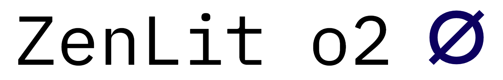

  

 

# ZenLit-o2

A fast, minimalist JavaScript chess engine wrapper and GUI. ZenLit-o2 runs a highly optimized WebAssembly (WASM) port of Stockfish, achieving a **~3650 ELO** playing strength with under 5000ms movetime.

**Launch** [katsugachi.github.io/ZenLit-o2](http://katsugachi.github.io/ZenLit-o2)

## Local Development
1. Download repo
